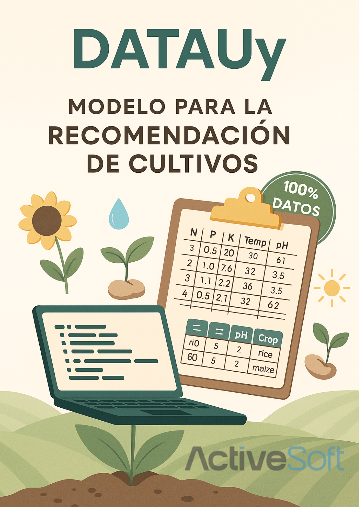

# 🌱 Proyecto Final – DataUy / Recomendación de Cultivos

Este notebook fue desarrollado como proyecto final del programa **DataUy – Formación Movistar**. Se analiza un dataset de condiciones climáticas y del suelo, para recomendar el cultivo más adecuado según los parámetros registrados.

## 📂 Contenido
- Análisis exploratorio visual
- Modelado predictivo con Random Forest, KNN y SVM
- Comparación de métricas
- Predicción personalizada
- Estética pastel chic 

---

📌 Autora: **Victoria Crosina**  
📍 Montevideo, Uruguay  
💼 ActiveSoft 
